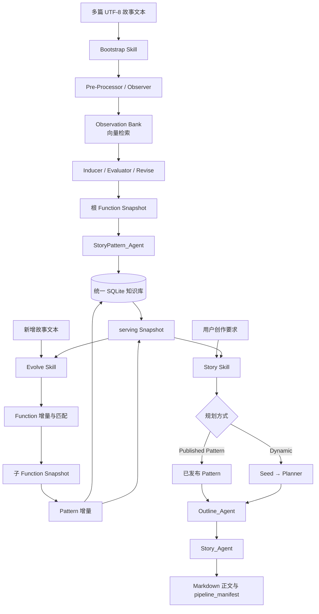

# Function-Extraction

基于 Vladimir Propp《民间故事形态学》的叙事结构分析与故事生成系统。

项目使用 LLM、向量检索和结构化数据模型，把故事文本中的叙事行动归纳为可复用的 **Function**，再从 Function 组合出 **Pattern**，最后根据用户的创作要求生成大纲和故事正文。

## 项目目的

项目试图建立一条可持续演化的叙事知识流水线：

1. 从多篇故事中提取和归纳跨故事的结构功能，而不是只做关键词统计。
2. 将 Function 和 Pattern 作为版本化知识资产保存，支持新增语料后的增量演化。
3. 使用已发布的叙事结构辅助故事创作，同时保留根据用户要求动态规划的能力。
4. 让每次运行都有 Run、Snapshot、产物 manifest 和校验结果，便于追踪和复核。

## 架构

整体流程可以概括为：

```text
故事文本
   │
   ▼
Bootstrap ──► Observation ──► Function ──► Function Snapshot
                                             │
                                             ▼
                                           Pattern
                                             │
                                             ▼
                                           serving

新故事文本 ──► Evolve：基于 serving Snapshot 增量提取 ──► 子 Snapshot ──► Pattern 增量

用户创作要求 ──► Published Pattern / Dynamic Planner ──► Outline ──► Story 正文
```

对应的阶段流程图如下：



其中 Bootstrap 和 Evolve 负责生产、更新知识库，Story 负责消费当前 serving Snapshot。Dynamic 路径不会先强行套用固定 Function 链，而是先从用户要求生成 Seed，再由 Planner 组合 Function。

### Function 提取层

`FunctionExtract_Agent` 负责从故事文本中建立叙事知识：

- Pre-Processor 将文本整理为可分析的句子和段落。
- Observer 从句子中提取结构化 `NarrativeObservation`，包括事件、前因、结果、影响和人物关系等信息。
- Observation Bank 保存观察结果并提供向量检索。
- Inducer 根据跨故事相似 Observation 归纳 Function。
- Evaluator、Revise 和 Curator 对 Function 进行评估、合并、修订或剔除。
- Matcher 在 Evolve 阶段把新 Observation 匹配到已有 Function，并保留无法可靠匹配的证据用于发现新 Function。
- `FunctionCoordinator_Agent` 提供 Bootstrap/Evolve → Pattern 的底层阶段调度和有限重试；公开使用优先通过 `StoryCLI`。

### Pattern 层

`StoryPattern_Agent` 消费一个完整、通过校验的 Function Snapshot，分析故事中的 Function 序列、关系和重复变体，生成可发布的 PatternSet。

Pattern 是对故事结构组合方式的更高层总结，不等同于某一篇故事的原文模板。

### 故事生成层

- `Outline_Agent` 根据题材、Pattern 或动态规划结果生成结构化大纲，并进行大纲校验。
- `Story_Agent` 根据已保存的大纲生成正文，并进行 Story Validator 校验。
- `Pipeline_Agent` 编排 `Outline → Story`。
- `StoryCLI` 是面向用户的统一命令行入口。
- `StoryUI` 提供 Bootstrap、Evolve 和 Story 的轻量 Tkinter 界面。

Story 有两种规划方式：

- **Published Pattern**：读取 serving Snapshot 中已发布的 Pattern，结构更稳定、可控。
- **Dynamic Planner**：遵循“用户要求 → Seed → Planner”，根据当前创作要求动态组合兼容的 Function，更灵活。

### 持久化与版本

- `Code/data/knowledge/story_knowledge.db`：统一 SQLite 知识库，保存 Run、Snapshot、Pattern、Outline 和生成审计信息。
- `Code/data/ontology_snapshots/`：不可变的 Function Snapshot（代码中称为 OntologySnapshot）文件。
- `Code/data/bank/`、`Code/data/registry/`：Function 提取阶段的 Bank 和 Registry 运行资产。
- `Code/data/story_cli/`、`Code/data/pipeline_runs/`：CLI 运行目录和生成产物。
- `serving_snapshot_id`：当前供 Pattern 和 Story 默认读取的 Snapshot 指针。

Snapshot 是完整的知识边界。Evolve 以当前 serving Snapshot 为父版本生成子 Snapshot；只有 Function 和 Pattern 都通过现有门禁后，新的 Snapshot 才会成为 serving。失败运行不会替换原 serving。

## 数据库操作指南

正式数据库位于 `Code/data/knowledge/story_knowledge.db`，由 `KnowledgeBase.StoryKnowledgeStore` 统一管理。它保存 Run、故事版本、Observation、Function、Pattern、Outline 和 serving Snapshot 指针。

Snapshot 是正式知识的版本边界；不要把数据库中的“最新记录”当作某个 Snapshot 的完整内容。

日常只需要以下三个操作。

### 1. 查看状态

```bash
cd Code
.venv/bin/python -X utf8 -m StoryCLI library status
```

该命令可以查看数据库路径、各类记录数量、Run 类型和 Pattern 状态。

### 2. 备份数据库

正式库维护前先备份：

```bash
cd Code
sqlite3 data/knowledge/story_knowledge.db \
  ".backup 'data/knowledge/story_knowledge.db.backup'"
```

### 3. 检查数据库

迁移、复制或怀疑数据库异常时执行：

```bash
cd Code
sqlite3 data/knowledge/story_knowledge.db "PRAGMA integrity_check;"
sqlite3 data/knowledge/story_knowledge.db "PRAGMA foreign_key_check;"
```

正常情况下第一条返回 `ok`，第二条无输出。

### 写入原则

- 日常写入使用 `StoryCLI bootstrap` 或 `StoryCLI evolve`，不要直接修改 SQLite 表。
- Evolve 使用当前 serving Snapshot 作为父版本；成功后才切换新的 serving，失败时保留原 serving。
- 不要直接删除或覆盖 Snapshot、Function version、Pattern version 等正式版本数据。
- 需要清空重建时使用 `bootstrap --reset-formal`，旧资产会先归档到 `Code/data/formal_archives/`。
- 探索性测试使用数据库副本，不要污染正式库。

## 三种独立 Skill 的执行方法

项目将 Bootstrap、Evolve、Story 设计为三个独立的 Codex Skill。每个 Skill 负责一个顶层阶段，并自动完成该阶段内部已经定义好的子流程；不需要在内部步骤之间反复确认，也不会把三个阶段强行合并成一个总 Runner。

对应的项目 Skill 文件位于：

```text
skills/function-extraction/
├── function-extraction-bootstrap/SKILL.md
├── function-extraction-evolve/SKILL.md
└── function-extraction-story/SKILL.md
```

### 1. Bootstrap Skill：建立根知识库

适用于第一次建立 Function 根库，或者用户明确要求重建正式库的场景。

```text
调用：function-extraction-bootstrap
```

它会自动执行：

```text
文本 → Function 提取/评估 → 根 Function Snapshot → Pattern → serving
```

公开 CLI 对应命令：

```bash
cd Code
.venv/bin/python -X utf8 -m StoryCLI bootstrap \
  --input /path/to/bootstrap_texts
```

Bootstrap 输入至少需要两个 UTF-8 `.txt` 故事。实际使用时建议准备多篇、多个题材的故事，以提供足够的跨故事证据和结构多样性。Bootstrap Skill 不会继续运行 Evolve 或 Story。

只有明确需要清空并重建正式资产时，才增加 `--reset-formal`：

```bash
.venv/bin/python -X utf8 -m StoryCLI bootstrap \
  --reset-formal \
  --input /path/to/bootstrap_texts
```

正式资产会先归档到 `Code/data/formal_archives/`，而不是直接永久删除。

### 2. Evolve Skill：增量演化知识库

适用于 Bootstrap 完成后加入新的故事语料。Evolve 默认读取当前 serving Snapshot 作为父版本。

```text
调用：function-extraction-evolve
```

它会自动执行：

```text
新故事 → Function 增量匹配/归纳 → 子 Function Snapshot → Pattern 增量 → serving
```

公开 CLI 对应命令：

```bash
cd Code
.venv/bin/python -X utf8 -m StoryCLI evolve \
  --input /path/to/new_texts
```

Evolve 成功的前提是 Function 和 Pattern 阶段都通过。成功后新 Snapshot 自动切换为 serving；失败时保留原 serving 和不可变 Snapshot。输入应是真正的新故事，不能用内容发生变化的既有 `story_id` 冒充新文本。Evolve Skill 不运行 Bootstrap，也不继续运行 Story。

### 3. Story Skill：根据要求生成故事

适用于知识库已经有可用 serving Snapshot 之后的创作请求。

```text
调用：function-extraction-story
```

它会自动执行：

```text
用户要求 → Pattern 或 Dynamic Planner → Outline → Story 正文
```

Published Pattern：

```bash
cd Code
.venv/bin/python -X utf8 -m StoryCLI story generate \
  --request "现代情感：写一次克制的家庭关系修复，结局要有可观察的解决行动" \
  --planner-mode published
```

Dynamic Planner：

```bash
cd Code
.venv/bin/python -X utf8 -m StoryCLI story generate \
  --request "古风仙侠：写一个雨夜寻药故事，结局必须完成真相揭示" \
  --planner-mode dynamic
```

较长的创作要求可以改用 `--request-file`，它和 `--request` 二选一。创作要求中应包含且只包含一个可识别的题材方向。Story Skill 只消费 serving Snapshot，不运行 Bootstrap 或 Evolve。

## 推荐使用顺序

```text
1. Bootstrap Skill：用多篇故事建立根库
2. Evolve Skill：用新增故事增量更新 Function 和 Pattern
3. Story Skill：消费 serving Snapshot 生成 Outline 和 Story
```

三种 Skill 的关系是阶段顺序，而不是每次生成故事都重新执行 Bootstrap 或 Evolve。通常只在知识库需要建立或更新时运行前两个阶段；日常创作直接运行 Story Skill。

## 环境与更多命令

项目的 Python 入口位于 `Code/`，建议使用项目虚拟环境：

```bash
cd Code
.venv/bin/python -m pip install sentence-transformers chromadb openai pydantic langgraph
.venv/bin/python -m pip install --no-deps --target vendor \
  langgraph-checkpoint-sqlite sqlite-vec aiosqlite
```

LLM 配置、完整参数、输入格式、运行产物和故障处理见 [`Code/StoryCLI/README.md`](Code/StoryCLI/README.md)。查看当前正式库和 serving 指针：

```bash
cd Code
.venv/bin/python -X utf8 -m StoryCLI library status
```

自动校验通过只说明流程、结构和数据门禁通过，不等同于生成正文已经满足所有创作要求或具备稳定的文学质量；需要结合 `pipeline_manifest.json`、大纲和最终正文进行独立检查。
