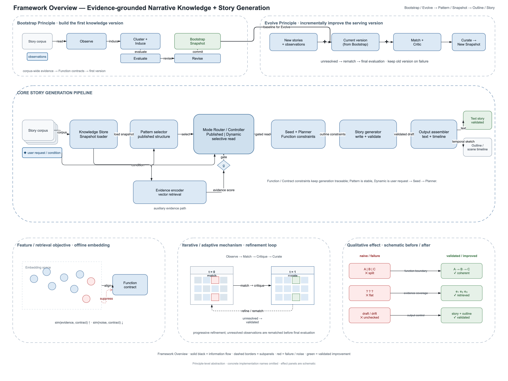

# 📚 Function-Extraction


基于 Vladimir Propp《民间故事形态学》的叙事结构分析与故事生成系统。

> 🔬 从故事中抽取结构，🧬 让结构持续演化，✍️ 把结构重新写成故事。

## 🌱 项目简介

Function-Extraction 试图回答一个问题：**故事中的“发生了什么”，能否被提炼为可复用、可演化、可验证的叙事结构？**

项目使用 LLM、向量检索和结构化数据模型，将自然语言故事拆解为叙事观察（Observation），从跨故事的共同行动中归纳叙事功能（Function），再进一步总结 Function 的组合方式（Pattern）。这些结构可以持续吸收新的故事语料，也可以辅助生成新的故事大纲和正文。

## ✨ 项目效果

- **看见故事结构**：把事件、前因、结果、人物关系和状态变化整理成结构化叙事证据。
- **发现跨故事共性**：从不同故事中归纳不依赖具体人名、地点和单一题材的叙事功能。
- **沉淀可复用模式**：总结故事中反复出现的结构，形成可以参考的故事模式，而不是照搬某一篇故事。
- **支持持续演化**：新故事可以在已有基础上继续学习，让这套知识不断更新。
- **连接分析与创作**：总结出的结构既能帮助分析故事，也能帮助生成新的故事，并支持按照用户要求灵活创作。
- **保留过程证据**：系统会保留处理过程和结果，方便之后查看、比较和复核。

## 🧬 方法论：从故事到结构

项目的分析思路来自 Propp 的故事形态学，但不止于给故事贴一个标签。一个故事会先被整体理解，再被拆解为连续的事件和叙事观察；随后系统关注这些事件如何配对、如何形成轮次和功能序列、由哪些角色承担，以及哪些组合可以跨故事复用。

可以把这套方法概括为：

```text
整体理解 → 事件观察 → 功能归纳 → 配对与序列 → 角色行动 → 结构模式
```

其中，Function 是故事推进的“骨架”，Observation 和辅助信息说明它具体如何发生；Pattern 则进一步回答“这些功能通常怎样组合”。这种从局部证据到整体图式的过程，让系统不仅能生成情节，也能解释情节的结构来源。

更完整的方法论记录见：[民间故事形态学分析流程](Books/Docs/README.md)。

## 🧭 总体架构

项目由两条相互衔接的主链路组成：

1. **叙事知识抽取**：故事语料 → Observation → Function → Pattern → serving Snapshot
2. **故事生成**：用户要求 → Dynamic / Published Pattern → Outline → Story 正文

### 🖼️ Framework Overview



### 🧠 算法框架一：叙事知识抽取

```mermaid
flowchart LR
    corpus["📚 故事语料"] --> bootstrap["Bootstrap"]
    bootstrap --> preprocess["文本预处理"]
    preprocess --> observer["Observer<br/>叙事观察"]
    observer --> bank[("Observation Bank<br/>结构化证据 + 向量检索")]
    bank --> retrieval["跨故事语义检索"]
    retrieval --> inducer["Inducer<br/>Function 归纳"]
    inducer --> review["Evaluator / Revise / Curator"]
    review --> snapshot["✅ Function Snapshot"]

    corpus --> evolve["Evolve"]
    serving[["🚦 当前 serving Snapshot"]] --> evolve
    evolve --> matcher["Matcher<br/>增量匹配与新证据"]
    matcher --> snapshot

    snapshot --> pattern["StoryPattern_Agent<br/>Pattern 分析"]
    pattern --> knowledge[("统一知识库<br/>Run / Snapshot / Pattern")]
    knowledge --> serving

    classDef input fill:#fff7ed,stroke:#f97316,color:#7c2d12
    classDef process fill:#eff6ff,stroke:#3b82f6,color:#1e3a8a
    classDef artifact fill:#ecfdf5,stroke:#10b981,color:#064e3b
    classDef store fill:#f5f3ff,stroke:#8b5cf6,color:#4c1d95
    class corpus,bootstrap,evolve input
    class preprocess,observer,retrieval,inducer,review,matcher,pattern process
    class snapshot,serving artifact
    class bank,knowledge store
```



抽取链路从故事中提炼可复用的叙事结构，先由 Bootstrap 建立基础版本，再由 Evolve 持续吸收新故事并更新知识。

### ✍️ 算法框架二：大纲与全文生成

```mermaid
flowchart LR
    request["📝 用户创作要求"] --> story["Story"]
    serving[["🚦 serving Snapshot"]] --> story
    story --> choice{"规划方式"}
    choice -->|"Dynamic（默认）"| seed["Seed<br/>形成故事级意图"]
    seed --> dynamic["Dynamic Planner<br/>组合兼容 Function"]
    choice -->|"Published（显式选择）"| published["已发布 Pattern<br/>稳定结构"]
    dynamic --> outline["Outline_Agent<br/>结构化大纲"]
    published --> outline
    outline --> outline_check{"Outline 校验"}
    outline_check -->|通过| writer["Story_Agent<br/>生成正文"]
    outline_check -->|失败| blocked["保留大纲并停止"]
    writer --> validator["Story Validator"]
    validator --> output["📄 正文与运行记录"]

    classDef input fill:#fff7ed,stroke:#f97316,color:#7c2d12
    classDef process fill:#eff6ff,stroke:#3b82f6,color:#1e3a8a
    classDef decision fill:#fefce8,stroke:#eab308,color:#713f12
    classDef artifact fill:#ecfdf5,stroke:#10b981,color:#064e3b
    class request,story input
    class seed,dynamic,published,outline,writer,validator process
    class choice,outline_check decision
    class serving,output,blocked artifact
```



生成链路根据用户要求选择合适的结构，先规划故事大纲，再生成并校验正文。

## 🔍 从整体生成效果看：本项目的差异

这里关注的不是模型响应速度或某个分数，而是最终生成出来的故事是否**有结构**：事件之间有没有因果，人物关系是否持续变化，冲突是否逐步升级，前文埋下的承诺是否在结局得到兑现。

许多网文生成项目更注重“把情节写出来”。它们通常从一个主题、人物设定或故事梗概直接进入章节和正文，优点是启动快、表达自由、局部场景容易写得热闹；但当故事变长，常见问题是情节之间靠偶然事件连接，人物为了推动剧情突然改变动机，关系变化缺少积累，结尾也容易变成对前文的简单收束。固定套路或章节模板可以让节奏更整齐，却可能让不同故事共享同一套推进方式；RAG 或范文续写可以让文本“像某类故事”，但内容相似并不等于真正理解了事件功能和因果关系。

Function-Extraction 在真正写正文之前，会先分析故事结构，再安排故事发展，最后生成大纲和正文。因此生成的故事不只是事件的堆叠，也更容易保持前后因果、人物动机和冲突发展的连贯性。

> 🎯 **核心差异**：很多方法直接从主题写到情节和正文；本项目会先整理故事结构，再用这些结构辅助创作，因此更重视前后连贯和因果关系。

这种结构性在生成效果中表现为：关键行动有前因和后果，人物关系的变化有过程，重复出现的情节会形成有差异的变体，前面留下的任务、冲突和承诺会在后文得到回应，而不是只靠新的事件不断把故事向前推。

这种结构性是本项目最重要的优势，也是它的代价：前置抽取和评估需要更多时间与语料，结构校验也不能替代文学表达。

## 🧩 三种独立 Skill

项目把完整流程拆成三个可以独立调用的 Codex Skill。每个 Skill 负责一个顶层阶段，并自动完成自己的内部流程，不在中间步骤反复打断用户。

### 🌱 Bootstrap：建立根知识库

用一批已有故事，先建立一套可以参考的故事结构知识。它适合项目第一次开始运行时使用，完成后就有了第一版基础，不负责后续更新或生成新故事。

### 🔁 Evolve：增量演化知识

当有了新故事后，可以在原有基础上继续学习和更新。每次更新都会先检查结果；如果不合适，就保留原来的版本，不影响已经建立好的知识。

### ✍️ Story：消费知识生成故事

当基础知识准备好后，输入一个创作要求，系统会先设计故事的大致结构，再据此写出正文。它既可以参考已经总结好的故事模式，也可以根据当前要求灵活组织情节。

## 💾 数据与版本

系统会保存故事知识、版本和生成过程，方便查看每次更新的来源和结果。每次更新都会建立新版本，确认没有问题后才替换当前版本；如果更新失败，仍会保留原来的版本。

## 🧱 核心组件

| 组件 | 职责 |
| --- | --- |
| `FunctionExtract_Agent` | 预处理故事、提取 Observation、归纳和演化 Function |
| `StoryPattern_Agent` | 从 Function 序列和证据中分析并发布 Pattern |
| `Outline_Agent` | 根据 Pattern 或 Dynamic Planner 生成结构化大纲 |
| `Story_Agent` | 根据大纲生成正文并执行正文校验 |
| `Pipeline_Agent` | 编排 Outline 到 Story 的生成链路 |
| `StoryCLI` / `StoryUI` | 提供统一命令行和轻量交互入口 |

## 🚀 开始使用

### 🧩 Codex Skill 入口

在 Codex 中可以按项目阶段直接进入对应 Skill：

- [Bootstrap Skill](skills/function-extraction/function-extraction-bootstrap/SKILL.md)：建立根知识库
- [Evolve Skill](skills/function-extraction/function-extraction-evolve/SKILL.md)：增量演化 Function 和 Pattern
- [Story Skill](skills/function-extraction/function-extraction-story/SKILL.md)：根据用户要求生成大纲和正文

### 🛠️ 运行文档

环境准备、输入格式、运行方式、命令行参数和数据库操作已独立整理，请跳转查看 **[运行与命令行指南](Code/StoryCLI/README.md)**。

## 📎 项目边界

这是一个持续实验和演化中的叙事系统：结构门禁、版本一致性和可追溯性是工程基础；真实的文学质量、长文本稳定性和用户要求保真，仍需要结合实际生成的 Outline 与正文进行独立判断。
